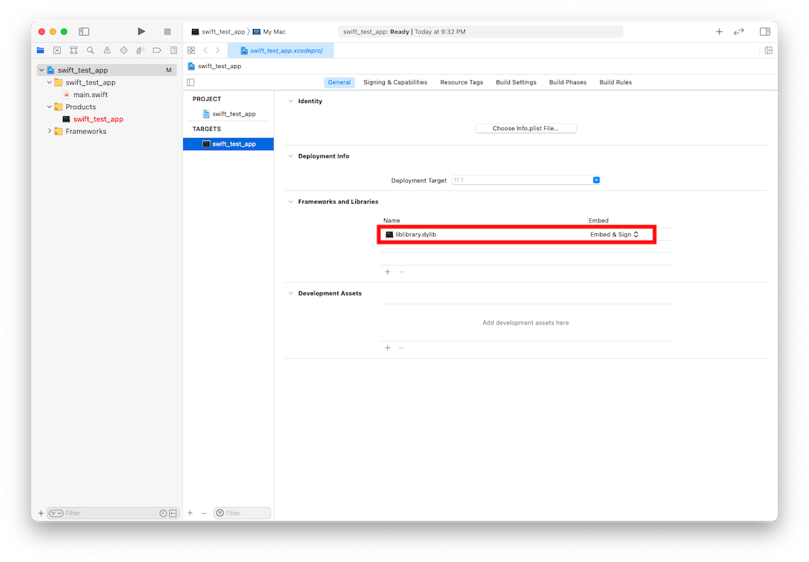
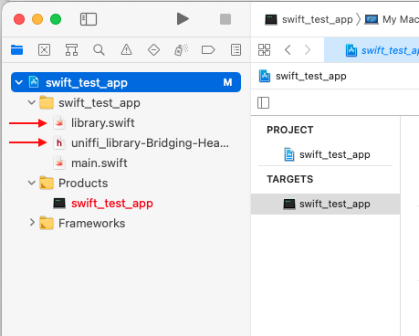

# Creating Language Wrappers For Rust Libraries - Part 2


## Background
In the previous tutorial ([Creating Language Wrappers for Rust Libraries - Part 1](https://github.com/sudoplatform-labs/ffi-tutorials/tree/main/Wrapper_Intro)), methods were presented for creating platform-independent and programming language-independent libraries using the [Rust](https://www.rust-lang.org) programming language.  Part 1 also demonstrated how to use the [Mozilla](https://www.mozilla.org/) [uniffi](https://github.com/mozilla/uniffi-rs) tool to *automatically* generate language wrappers for Swift and Python. Test applications (for Swift and Python) were created and used to demonstrate how to import the Rust library using the generated language wrappers.  (Note:  some of the example material was adapted from various uniffi examples.)


## Tutorial

This tutorial will build upon the library and test applications created in Part 1 in order to demonstrate how each of the supported data type elements can be passed through the language wrappers to the linked Rust and how data types can be returned from the Rust library.  A description of each of the data types and now they correspond to equivalent types in other programming languages will also be discussed.  As in Part 1, the following will be created and discussed:

* Rust library
* UDL file
* Swift test app
* Python test app


## Mozilla's uniffi Tool Automates FFI Processes

As a review from Part 1, building a Rust library and language wrappers using the uniffi tools is done as follows:

1. Create a custom Rust library
	1. Expose the desired API for the library.  The API will consist of all top-level functions
	2. Setup a Cargo.toml file that specifies that the crate will be built as a dylib
	3. Build and test the library

2. Create a [*UDL*](https://mozilla.github.io/uniffi-rs/udl_file_spec.html) representation of each of the API functions
	1. UDL is a uniffi-specific design language that is a variation of Web Interface Definition Language (Web IDL)
	2. The UDL file will describe each of the top-level functions in the library

3. Use the uniffi tool to create a [*scaffolding layer*](https://mozilla.github.io/uniffi-rs/tutorial/Rust_scaffolding.html) for the library
	1. The scaffolding layer is a set of helper code that is used to make the top-level functions available to the foreign-language bindings

4. Create language-specific [bindings](https://mozilla.github.io/uniffi-rs/tutorial/foreign_language_bindings.html)
	1. This makes FFI calls look & feel like native code (e.g., Swift FFI feels like native Swift)

5. Import the scaffolding code, the language-specific code, and the generated library into a native application


## Creating the Rust Library
To get started, open a terminal window and create a project directory that will contain each of the library and applications for this tutorial.  In the terminal, navigate to the project directory and create a new rust library called *library*, as follows:

`cargo new --lib library` 

### Edit the Cargo.toml file
Next, navigate into the new *library* sub-directory just created, open Cargo.toml, and add the following (substituting your own values as desired), so that it looks like this:

```
[package]
name = "library"
version = "0.1.0"
authors = ["Steve McCown <smccown@anonyome.com>"]
license = "Apache version 2.0"
edition = "2018"
build = "build.rs"

# See more keys and their definitions at https://doc.rust-lang.org/cargo/reference/manifest.html

[dependencies]
uniffi = "0.8"
# includes the 'thiserror' crate.
thiserror = "1.0"

[lib]
name = "library"
crate-type = ["cdylib"]

[build-dependencies]
uniffi_build = "0.8"
```

These additions tell cargo to load uniffi version 0.8 and to create a cdylib named library.  

### Include the uniffi Rust Binding Code
Now, go into the src sub-directory, edit lib.rs, and add the following line to the **top** of the file:

```
include!("library.uniffi.uniffi.rs"); 
```

The include statement instructs the Rust compiler to load the Rust binding file.  *Please note that this file will not have been created by this point, but it will be once the scaffolding and binding layers are generated (see below).*  

### Create Routines To Test Each Supported Type
In order to test the capabilities of the language wrappers, several public test functions will be created and added to the lib.rs file.  Each of the following test routines will provide a very simple function that will receive a specific data type as an input parameter and then return a corresponding data type as a result.  This series of test routines will use each of the Rust data types that is currently supported by uniffi.  *(Please note:  for simplicity, no error checking is performed unless it is a necessary part of the demonstration.)*

### Add A Boolean Test Routine
Now, add the same boolean function that was created in Part 1.  The function receives a boolean value as an input parameter and returns its inverse.

```
fn bool_inc_test(value: bool) -> bool {

    return !value
}
```

### Add Some Integer Test Routines
In Rust, signed integers can be defined as 8-bit, 16-bit, 32-bit, or 64-bit values.  To demonstrate a simple test, each of the functions below will receive an integer value, increment it by 1, and return the result.  

```
pub fn i8_inc_test(value: i8) -> i8 {

    return value + 1
}

pub fn i16_inc_test(value: i16) -> i16 {

    return value + 1
}

pub fn i32_inc_test(value: i32) -> i32 {

    return value + 1
}

pub fn i64_inc_test(value: i64) -> i64 {

    return value + 1
}
```

### Add Some Unsigned Integer Test Routines
In Rust, unsigned integers can be also defined as 8-bit, 16-bit, 32-bit, or 64-bit values.  To demonstrate a simple test, each of the functions below will receive an unsigned int value, increment it by 1, and return the result.  


```
pub fn u8_inc_test(value: u8) -> u8 {

    return value + 1
}

pub fn u16_inc_test(value: u16) -> u16 {

    return value + 1
}

pub fn u32_inc_test(value: u32) -> u32 {

    return value + 1
}

pub fn u64_inc_test(value: u64) -> u64 {

    return value + 1
}
```

### Add A Float Test Routine
To test floating point values, create a test routine that accepts a float value, increments it by 1, and then returns the result.

```
pub fn float_inc_test(value: f32) -> f32 {

    return value + 1.0
}
```

### Add A Double Test Routine
To test double values, create a test routine that accepts a double value, increments it by 1, and then returns the result.

```
pub fn double_inc_test(value: f64) -> f64 {

    return value + 1.0
}
```

### Add A String Test Routine
For testing string values, create a test routine that accepts a string input value and then returns a concatenation of the input string with itself.


```
pub fn string_inc_test(value: String) -> String {

    return format!("{}{}", value, value);
}
```

### Add A Pass By Reference Test Routine
*Pass by reference* parameters pass a reference to a value into a function without actually copying the referenced data.  Since Rust implements strict ownership rules, multiple functions (e.g., caller and called) cannot write to the same data element, simultaneously.  While this test function shows how *pass by reference* paramenters are input and used, Rust's ownership rules preclude multiple write access.  For a more detailed view of the ownership rules, please see the [Rust Manual](https://doc.rust-lang.org/rust.html).  

As part of demonstrating *pass by reference* parameters, this test creates and uses a new data type structure.  The following *Point* structure defines a point value with an x-coordinate and a y-coordinate, which are each defined as 64-bit floating point values.  Add the following structure definition near the top of the lib.rs file:

```
#[derive(Debug, Clone)]
#[derive(PartialEq, PartialOrd)]
pub struct Point {
    x: f64,
    y: f64,
}
```

Next, create a test function that receives a Point input value by reference.  In this function, the input value will be cloned, its members incremented by 1, and then the result returned to the caller where the input and result are compared: 

```
pub fn byref_inc_test(value: &Point) -> Point {

    // Clone the input value & increment its members.
    let mut new_value = value.clone();
    new_value.x = value.x + 1.0;
    new_value.y = value.y + 1.0;

    return new_value;
}
```

### Add An Optional Test Routine
In Rust, optional values can represent either a valid value (of the specified type) or have the value of *None* (which shows that no type value is present).  Optional values are useful in functions that may return either a valid type value or may have failed to create one.  Please add the following routine, which tests the validity of the input value and increments its value and then returns the result:

```
pub fn optional_type_inc_test(value: Option<i32>) -> Option<i32> {

    let r_value: Option<i32>;

    match value {
        Option::Some(val) => 
            r_value = Some(val + 1),
        Option::None =>
            r_value = None
    };

    return r_value
}  
```

### Add A Vector Test Routine
In Rust, a vector is analagous to a re-sizable array.  In this test example, create a function that receives a mutuable vector that will contain Strings (i.e., Vec<String>), creates a duplicate of the input vector, and appends the input value to the newly created value.  More simply stated, this function is returning the concatenation of a copy of the input value with itself.

```
pub fn vector_inc_test(mut value: Vec<String>) -> Vec<String> {

    let mut new_value: Vec<String> = value.to_vec();
    new_value.append(&mut value);

    return new_value;
}
```

### Add A HashMap Test Routine
HashMaps, in Rust, are dictionaries of *key : value* pairs.  For this test, add a function that receives a HashMap with key : value pairs defined as HashMap<String, i32>.  In this function, clone the input value, add a new key : value pair (i.e., *"zero" : 0*), and then return the result as follows:

```
pub fn hash_map_inc_test(value: HashMap<String, i32>) -> HashMap<String, i32> {     // Only string keys are supported.

    let mut result = value.clone();
    result.insert(String::from("zero"), 0);

    return result;
}
```

### Add A Void Test Routine
When a Rust function returns a 'void' value (designated as '*( )*'), it is stating that no value of any type is returned.  Create a test routine that returns a void, as follows:

```
pub fn void_inc_test(_value: i32) -> () {

    return ();
}
```

### Add An Error Code Test Routine
Throwing and catching exceptions (errors) is common practice in modern programming languages.  In Rust, it is also possible to create custom exception types.  These exceptions can be *thrown* in an underlying library, pass through the uniffi scaffolding and language wrapper layers, and then be handled in an exception handler provided by the higher-level application.  

For example, ArithmeticError is a custom Rust error (borrowed from one of the uniffi examples) that can be thrown when the sum of two values overflows the range of 64-bit unsigned integers.  Please put the following error definition near the top of the lib.rs file:

```
#[derive(Debug, thiserror::Error)]
pub enum ArithmeticError {
    #[error("Integer overflow on an operation with {a} and {b}")]
    IntegerOverflow { a: u64, b: u64 },
}
```

Once ArithmeticError has been defined, it can be used within lib.rs, as well as, in applications that import the Rust library.  In the following example, two 64-bit integers are added together and if the result overflows the 64-bit unsigned int range of values, then the ArithmeticError will be generated.

```
pub fn error_inc_test(a: u64, b: u64) -> Result<u64, ArithmeticError> {

    let a1: u64 = a;
    a1.checked_add(b).ok_or(ArithmeticError::IntegerOverflow { a, b })
}
```

## Create the UDL File
Just like in Part 1, once the Rust library is created and its API defined, it's time to create the UDL file.  The UDL file is also created in the library/src directory.  This file will define each the public functions, type structures, and custom errors created above.  The reason for creating a custom UDL representation of these items is that it makes it easier for uniffi to generate the scaffolding and language wrapper layers.  A byproduct of this process is that it also helps the programmer(s) to see each of the library's public members.

To create the UDL, start by creating a file called *library.uniffi.udl*.  The uniffi naming convention is such that the name *'library'* is the same name chosen as the name of the project's library and '.uniffi.udl' denotes that it is a uniffi UDL file.  In UDL, all of the API functions must be specified in the UDL file under the *namespace* block while the types and error definitions are declared outside of the namespace block. UDL reads like a pseudocode representation of the public interface.  The types used in this file adhere to the [UDL specification](https://mozilla.github.io/uniffi-rs/udl_file_spec.html).  UDL can be used to specify many other types, enumerations, structs, dictionaries, interfaces, objects, and errors, however, those are not covered in this tutorial. Please dd the following lines to the new UDL file:

```
[Error]
enum ArithmeticError {
    "IntegerOverflow",
};

dictionary Point {
    double x;
    double y;
};

namespace library {

    boolean bool_inc_test(boolean value);

    i8 i8_inc_test(i8 value);
    i16 i16_inc_test(i16 value);
    i32 i32_inc_test(i32 value);
    i64 i64_inc_test(i64 value);

    u8 u8_inc_test(u8 value);
    u16 u16_inc_test(u16 value);
    u32 u32_inc_test(u32 value);
    u64 u64_inc_test(u64 value);

    f32 float_inc_test(f32 value);

    f64 double_inc_test(f64 value);

    string string_inc_test(string value);

    Point byref_inc_test([ByRef] Point value);

    i32? optional_type_inc_test(i32? value);

    sequence<string> vector_inc_test(sequence<string> value);

    record<DOMString, i32> hash_map_inc_test(record<DOMString, i32> value);

    void void_inc_test(i32 value);

    [Throws=ArithmeticError]
    u64 error_inc_test(u64 a, u64 b);
};
```

## Generate The Scaffolding Layer

The scaffolding layer is set of code that exposes the library's API and serializes the specified data types as an enhanced FFI layer.  Generating the scaffolding layer is a simple process that is done at the command line by typing:

`
uniffi-bindgen scaffolding ./src/library.uniffi.udl
`

Executing this command will create a file called *./src/library.uniffi.uniffi.rs*. It is important to *not* modify this file.  However, viewing it in a code editor will show that ~477 lines of rust code have been created. This code implements the FFI layer and contains numerous comments describing its operation.  The FFI routine corresponding to the boolean test's API function, bool_inc_test( ), created above is found at line ~163 and reads as follows:

```
163 #[allow(clippy::all)]
164 #[doc(hidden)]
165 #[no_mangle]
166 pub extern "C" fn library_c453_bool_inc_test(
167     value: i8,
168     err: &mut uniffi::deps::ffi_support::ExternError,
169 ) -> i8 {
170     // If the provided function does not match the signature specified in the UDL
171     // then this attempt to call it will not compile, and will give guidance as to why.
172     uniffi::deps::log::debug!("library_c453_bool_inc_test");
173 
174     uniffi::deps::ffi_support::call_with_output(err, || {
175         let _retval = bool_inc_test(<bool as uniffi::ViaFfi>::try_lift(value).unwrap());
176         <bool as uniffi::ViaFfi>::lower(_retval)
177     })
178 }
```

While this code contains a valid FFI function and can be called, it is also in a format that might appear a little strange to application programmers who are not also C-programmers.  For that reason a language-specific wrapper function can simplify calls into the library.

## Build the Rust Library

Go to the library sub-directory and type:

`cargo build`

This will build the rust library according to the settings in Cargo.toml.  If everything is successful, the output should be similar to:

```
% cargo build
   Compiling library v0.1.0 (/Users/username/Development/rust/WrapperTests/Wrapper1/library)
    Finished dev [unoptimized + debuginfo] target(s) in 0.70s
```

## Genrating a Swift Language Wrapper

With the library created and the scaffolding layer generated, it is time to create the Swift-language bindings.  This also consists of a single line of code:

```
uniffi-bindgen generate ./src/library.uniffi.udl --language swift
```

This command should complete without error.  However, it does rely on a tool called *SwiftFormat*, which, if not installed, will yield a warning similar to the following:

```
Warning: Unable to auto-format library.swift using swiftformat: Os { code: 2, kind: NotFound,
message: "No such file or directory" }
```

If this warning appears, it may simply be ignored and will result in no ill effects during execution of the applications importing this library.  However, to reformat the Swift code (and make this warning disappear), it is necessary to install the SwiftFormat tool, which can be installed using *brew* as follows:

```
brew install swiftformat
```

Once SwiftFormat is installed, run the uniffi-bindgen command again and the generated Swift-language code will be regenerated and formatted without a warning message.

This process generates a file called *library.swift* that has ~751 lines of code.  The Swift representation of the bool_inc_test( ) function and appears on line ~574 as follows:

```
574 public func boolIncTest(value: Bool) -> Bool {
575     let _retval = try! rustCall(
576         UniffiInternalError.unknown("rustCall")
577 
578     ) { err in
579         library_c453_bool_inc_test(value.lower(), err)
580     }
581     return try! Bool.lift(_retval)
582 }
```

Please note that the Swift function has been formatted in the style of other Swift source code -- even the name has been converted from *snake case* (used in Rust) to *camel case* (used in Swift).  Additionally, this Swift function invokes (on line 579) the function, library_c453_bool_inc_test( ), that was generated in *./src/library.uniffi.uniffi.rs* above.  

Although, this language wrapper generation step isn't strictly necessary from an FFI perspective, it is of notable value to the Swift programmers who will import the library.  This step allows them to interface with the library that looks and feels like Swift rather than having to learn how to C programming interfaces and manage C data types.

## Genrating a Python Language Wrapper

With the library created and the scaffolding layer generated, it is time to create the Python-language bindings.  (The steps to creating the Python wrapper are very similar to those used to generate the Swift code above.) This also consists of a single line of code:

```
uniffi-bindgen generate ./src/library.uniffi.udl --language python
```

This command should complete without error.  However, it does rely on a tool called *yapf*, which, if not installed, will yield a warning similar to the following:

```
Warning: Unable to auto-format library.py using yapf: Os { code: 2, kind: NotFound, message: "No such file or directory" }
```

If this warning appears, it may simply be ignored and will result in no ill effects during execution of the applications importing this library.  However, to reformat the Python code (and make this warning disappear), it is necessary to install the tool, which can be installed using *brew* as follows:

```
brew install yapf
```

Once yapf is installed, run the uniffi-bindgen command again and the generated Python-language code will be regenerated and formatted without a warning message.

This process generates a file called *library.py* that has ~783 lines of code.  Theis file contains the Python representation of the bool_inc_test( ) function on line ~ 615 and appears as follows:

```
615 def bool_inc_test(value):
616     value = bool(value)
617     _retval = rust_call_with_error(InternalError,_UniFFILib.library_c453_bool_inc_test,(1 if value else 0))
618     return (True if _retval else False)
```

Please note that the Python function has been formatted in the style of other Python source code.  Additionally, this Python function invokes (on line 617) the function, _UniFFILib.library_c453_bool_inc_test( ), that was generated in *./src/library.uniffi.uniffi.rs* above.  

Although, this language wrapper generation step isn't strictly necessary from an FFI perspective, it is of notable value to the Python programmers who will import the library.  This step allows them to interface with a code interface to the library the looks and feels like Python rather than having to learn how to call C programming interfaces and manage C data types.


## Swift Application: Calling the Rust Library

Once the library has been created, the scaffolding layer generated, and the Swift language wrapper generated, it is time to test importing the library into a Swift application.  To test this part of the tutorial, a macOS Swift app will be created.  To create the test app, do the following:

1. Launch Xcode and select File | New | Project  
2. Click *macOS* for the new project template
3. Select *Command Line Tool* and click *Next*
4. Name the project *swift\_test\_app* and click *Next*
5. A dialog box will appear asking where to save the project.  Select the main tutorial directory used for this tutorial and press *Create*

The preceeding steps will result in an empty, but runnable, Swift-based command line tool for macOS.  Next, the library must be linked and the scaffolding layer and language bindings must be added to the Xcode project, as follows:

1. In Xcode, select the target *swift_test_app*, select *General*, and add the Rust library (../library/target/debug/liblibrary.dylib) to the *Frameworks and Libraries* section, as follows:

2. Add the directory containing the Rust library (dylib) to the Xcode project's *Library Search Paths*
3. Add the Swift language files generated by uniffi above.  The files to be added include
	1. library.swift
	2. uniffi_library-Bridging-Header.h

	
4. Add the bridging header to the Xcode target by adding *../library/src/uniffi_library-Bridging-Header.h* to *Swift Compiler - General*

At this point, the test app should import the required files, link to the library, and run ... without doing anything.  To test each of the functions provided by the library, it is necessary to add the Swift function calls to *main.swift*, as follows:

```
  1 //
  2 //  main.swift
  3 //  test_app
  4 //
  5 //  Created by Steven H. McCown on 2/9/21.
  6 //
  7 
  8 import Foundation
  9 
 10 print(" --- Running Tests --- ")
 11 
 12 print("Running boolean test...")
 13 let valueBool: Bool = false
 14 var resultBool: Bool = boolIncTest(value: valueBool)
 15 assert(!valueBool == resultBool, "Bool test failed")
 16 
 17 
 18 print("Running signed int tests...");
 19 let valueI8: Int8 = 0;
 20 var resultI8: Int8 = i8IncTest(value: valueI8);
 21 assert(resultI8 == (valueI8 + 1), "i8 test failed");
 22 
 23 let valueI16: Int16 = 0;
 24 var resultI16: Int16 = i16IncTest(value: valueI16);
 25 assert(resultI16 == (valueI16 + 1), "i16 test failed");
 26 
 27 let valueI32: Int32 = 0;
 28 var resultI32: Int32 = i32IncTest(value: valueI32);
 29 assert(resultI32 == (valueI32 + 1), "i32 test failed");
 30 
 31 let valueI64: Int64 = 0;
 32 var resultI64: Int64 = i64IncTest(value: valueI64);
 33 assert(resultI64 == (valueI64 + 1), "i64 test failed");
 34 
 35 
 36 print("Running unsigned int tests...");
 37 let valueU8: UInt8 = 0;
 38 var resultU8: UInt8 = u8IncTest(value: valueU8);
 39 assert(resultI8 == (valueI8 + 1), "u8 test failed");
 40 
 41 let valueU16: UInt16 = 0;
 42 var resultU16: UInt16 = u16IncTest(value: valueU16);
 43 assert(resultI16 == (valueI16 + 1), "u16 test failed");
 44 
 45 let valueU32: UInt32 = 0;
 46 var resultU32: UInt32 = u32IncTest(value: valueU32);
 47 assert(resultI32 == (valueI32 + 1), "u32 test failed");
 48 
 49 let valueU64: UInt64 = 0;
 50 var resultU64: UInt64 = u64IncTest(value: valueU64);
 51 assert(resultI64 == (valueI64 + 1), "u64 test failed");
 52 
 53 
 54 print("Running float test...");
 55 let floatValue: Float32 = 0.0;
 56 assert(floatIncTest(value: floatValue) == (floatValue + 1.0), "float test failed");
 57 
 58 
 59 print("Running double test...");
 60 let doubleValue: Double = 0.0;
 61 assert(doubleIncTest(value: doubleValue) == (doubleValue + 1.0), "double test failed");
 62 
 63 
 64 print("Running String test...");
 65 let message: String = "Hello World!";
 66 let targetMessage: String = "\(message)\(message)";
 67 assert(stringIncTest(value: message) == targetMessage, "string test failed");
 68 
 69 
 70 print("Running byRef test...");
 71 let byrefValue: Point = Point(x: 1.0, y: 2.0);
 72 let byrefResult: Point = byrefIncTest(value: byrefValue);
 73 assert(byrefResult.x == (byrefValue.x + 1.0), "byRef test failed");
 74 assert(byrefResult.y == (byrefValue.y + 1.0), "byRef test failed");
 75 
 76 
 77 print("Running option type test...");
 78 let optionalValue : Int32 = 0;
 79 var optionalResult : Int32 = optionalTypeIncTest(value: optionalValue) ?? -1;
 80 assert(optionalResult == (optionalValue + 1), "optional (Int32) test failed");
 81 
 82 
 83 print("Running vector test...");
 84 let arrayValue: [String] = ["one", "two", "three"]
 85 var arrayResult: [String] = []
 86 arrayResult = vectorIncTest(value: arrayValue)
 87 assert(arrayResult == (arrayValue + arrayValue), "Vector (array) test failed")
 88 
 89 
 90 print("Running HashMap test...");
 91 var arrayDictionaryValue = [String : Int32] ()
 92 arrayDictionaryValue["one"] = 1
 93 arrayDictionaryValue["two"] = 2
 94 arrayDictionaryValue["three"] = 3
 95 var arrayDictionaryResult = [String : Int32] ()
 96 arrayDictionaryResult = hashMapIncTest(value: arrayDictionaryValue)
 97 arrayDictionaryValue["zero"] = 0;
 98 assert(arrayDictionaryValue == arrayDictionaryResult, "HashMap (Dictionary) test failed")
 99 
100 
101 print("Running void test...")
102 let voidValue : Int32 = 0
103 var voidResult : () = voidIncTest(value: voidValue)
104 assert(voidResult == (), "Void test failed")
105 
106 
107 print("Running Error Code Test On Success test...");
108 let value1: UInt64 = 0;
109 let value2: UInt64 = 1;
110 do {
111     let rValue = try errorIncTest(a: value1, b: value2);
112     print("     Returned value = \(rValue)");
113 } catch (let exception) {
114     print("     Returned value = \(exception)");
115 }
116 
117 
118 print("Running Error Code Test On Failure test...");
119 let val1: UInt64 = UInt64.max;
120 let val2: UInt64 = 1;
121 do {
122     let rValue = try errorIncTest(a: val1, b: val2);
123     print("     Returned value = \(rValue)");
124 } catch (let exception) {
125     print("     Returned value = \(exception)");
126 }
127 
128 
129 print(" --- End of Tests ---\n");
```

In these tests, initial values a created and passed into the various library functions, which do some simple calculations and then return the calculated value. For numeric values, the library functions increment the input value and return the calculated result.  For string functions, the library functions return a concatenation of the input string with itself.  For Vector and HashMap tests, the library functions return the input value with a new member added.  Finally, the exception handling test calls the errorIncTest( ) twice.  The first time errorIncTest( ) is called, it is called with valid input values in order to generate a successful result.  The second time errorInctest( ) is called, it is intentionally called with one value containing the maximum value of a UInt64 type, so that when added to the second input value, it will overflow the UInt64 range and generate an IntegerOverflow exception.

If the library is successfully linked and the public functions correctly called, the following messages should be displayed:

```
 --- Running Tests --- 
Running boolean test...
Running signed int tests...
Running unsigned int tests...
Running float test...
Running double test...
Running String test...
Running byRef test...
Running option type test...
Running vector test...
Running HashMap test...
Running void test...
Running Error Code Test On Success test...
     Returned value = 1
Running Error Code Test On Failure test...
     Returned value = IntegerOverflow(message: "Integer overflow on an operation with 18446744073709551615 and 1")
 --- End of Tests ---
```
<BR>

## Python Application: Calling the Rust Library

Creating the Python test application is much simpler than the Swift version, because it does not need a project configuration.  To create the Python test application, do the following:

1. Go to the tutorial main directory and create a sub-directory called *python_test_app* and navigate into it
2. Copy the required library files into *python_test_app* (or they can be referenced via command line parameters)
	1. ./library/target/debug/libuniffi_library.dylib
	2. ./library/src/library.py
3. Create the main Python application file (main.py).  Natively, Python provides int, float, and complex as its supported numeric value types.  Since the Rust library generated above uses numeric values with specific bit lengths and sign values, it is necessary to import a third-party library.  For these tests, *numpy* is used to provide finer control over numeric type values.  Please add the following to main.py:

```
  1 import numpy
  2 
  3 import library
  4 
  5 print("\n --- Running Tests --- \n")
  6 
  7 print("Running boolean test...", end="  ")
  8 valueBool = False
  9 resultBool = library.bool_inc_test(valueBool)
 10 assert ((not valueBool) == resultBool), "Bool test failed"
 11 print("Passed")
 12 
 13 print("Running signed int tests...", end="  ")
 14 valueI8: numpy.int8 = 0
 15 resultI8: numpy.int8 = library.i8_inc_test(valueI8)
 16 assert (resultI8 == (valueI8 + 1)), "i8 test failed"
 17 
 18 valueI16: numpy.int16 = 0
 19 resultI16: numpy.int16 = library.i16_inc_test(valueI16)
 20 assert (resultI16 == (valueI16 + 1)), "i16 test failed"
 21 
 22 valueI32: numpy.int32 = 0
 23 resultI32: numpy.int32 = library.i32_inc_test(valueI32)
 24 assert (resultI32 == (valueI32 + 1)), "i32 test failed"
 25 
 26 valueI64: numpy.int64 = 0
 27 resultI64: numpy.int64 = library.i64_inc_test(valueI64)
 28 assert (resultI64 == (valueI64 + 1)), "i64 test failed"
 29 print("Passed")
 30 
 31 
 32 print("Running unsigned int tests...", end="  ")
 33 valueU8: numpy.uint8 = 0
 34 resultU8: numpy.uint8 = library.u8_inc_test(valueU8)
 35 assert (resultU8 == (valueU8 + 1)), "u8 test failed"
 36 
 37 valueU16: numpy.uint16 = 0
 38 resultU16: numpy.uint16 = library.u16_inc_test(valueU16)
 39 assert (resultU16 == (valueU16 + 1)), "u16 test failed"
 40 
 41 valueU32: numpy.uint32 = 0
 42 resultU32: numpy.uint32 = library.u32_inc_test(valueU32)
 43 assert (resultU32 == (valueU32 + 1)), "u32 test failed"
 44 
 45 valueU64: numpy.uint64 = 0
 46 resultU64: numpy.uint64 = library.u64_inc_test(valueU64)
 47 assert (resultU64 == (valueU64 + 1)), "u64 test failed"
 48 print("Passed")
 49 
 50 
 51 print("Running float test...", end="  ")
 52 floatValue: numpy.float32 = 0.0
 53 assert (library.float_inc_test(floatValue) == (floatValue + 1.0)), "float test failed"
 54 print("Passed")
 55 
 56 
 57 print("Running double test...", end="  ")
 58 doubleValue: numpy.double = 0.0
 59 assert (library.double_inc_test(doubleValue) == (doubleValue + 1.0)), "double test failed"
 60 print("Passed")
 61 
 62 
 63 print("Running String test...", end="  ")
 64 message = "Hello World!"
 65 targetMessage = message + message
 66 assert (library.string_inc_test(message) == targetMessage), "string test failed"
 67 print("Passed")
 68 
 69 
 70 print("Running byRef test...", end="\t")
 71 byrefValue: library.Point = library.Point(1.0, 2.0)
 72 byrefResult: library.Point = library.byref_inc_test(byrefValue)
 73 assert (byrefResult.x == (byrefValue.x + 1.0)), "byRef test failed"
 74 assert (byrefResult.y == (byrefValue.y + 1.0)), "byRef test failed"
 75 print("Passed")
 76 
 77 
 78 print("Running option type test (test for int32)...", end="  ")
 79 optionalValue : numpy.int32 = 0
 80 optionalResult : numpy.int32 = library.optional_type_inc_test(optionalValue)
 81 if optionalResult != None:
 82     assert(optionalResult == (optionalValue + 1)), "optional type test returned None"
 83     print("Passed")
 84     print("\tReturned value = " + str(optionalResult))
 85 else:
 86     print("Failed")
 87     print("\tReturned value = None when an int32 was expected")
 88 
 89 
 90 print("Running option type test (test for None)...", end="  ")
 91 optionalValue : numpy.int32 = None
 92 optionalResult : numpy.int32 = library.optional_type_inc_test(optionalValue)
 93 if optionalResult != None:
 94     print("Failed")
 95     print("\tReturned value = " + str(optionalResult) + " when None was expected")
 96 else:
 97     print("Passed")
 98     print("\tReturned value = None")
 99 
100 
101 print("Running vector test...", end="  ");
102 arrayValue = ["one", "two", "three"]
103 arrayResult = library.vector_inc_test(arrayValue)
104 assert(arrayResult == (arrayValue + arrayValue)), "Vector (array) test failed"
105 print("Passed")
106 print ("\tarrayResult = ", end=" ")
107 print (' '.join(arrayResult))
108 
109 
110 print("Running HashMap test...", end="  ");
111 arrayDictionaryValue = {
112     "one" : 1,
113     "two" : 2,
114     "three" : 3 }
115 arrayDictionaryResult = library.hash_map_inc_test(arrayDictionaryValue)
116 arrayDictionaryValue["zero"] = 0
117 assert(arrayDictionaryValue == arrayDictionaryResult), "HashMap (Dictionary) test failed"
118 print("Passed")
119 
120 print("Running void test...", end="  ")
121 voidValue : numpy.int32 = 0
122 voidResult = library.void_inc_test(voidValue)
123 assert (voidResult == None), "Void test failed"
124 print("Passed")
125 
126 
127 print("Running Error Code Test On Success test...", end="  ")
128 value1: numpy.uint64 = 0
129 value2: numpy.uint64 = 1
130 try:
131     rValue = library.error_inc_test(value1, value2)
132     print("Passed")
133     print("\tReturned value = " + str(rValue))
134 except ArithmeticError.IntegerOverflow:
135     print("Failed")
136     print("\tReturned value = " + str(exception))
137 
138 
139 print("Running Error Code Test On Failure test...", end="  ")
140 value1: numpy.uint64 = numpy.iinfo(numpy.uint64).max
141 value2: numpy.uint64 = 1
142 try:
143     rValue = library.error_inc_test(value1, value2)
144     print("Failed")
145     print("\tReturned value = " + str(rValue))
146 except library.ArithmeticError.IntegerOverflow as ex:
147     print("Passed")
148     print("\tReturned value = error" + ex.args[0])
149 
150 
151 print("\n --- End of Tests ---\n")
```

To execute main.py, type

`python3 main.py`

If the test routines successfully invoked the library routines, the following output should be displayed int the terminal:

```
% python3 main.py

 --- Running Tests --- 

Running boolean test...  Passed
Running signed int tests...  Passed
Running unsigned int tests...  Passed
Running float test...  Passed
Running double test...  Passed
Running String test...  Passed
Running byRef test...	Passed
Running option type test (test for int32)...  Passed
	Returned value = 1
Running option type test (test for None)...  Passed
	Returned value = None
Running vector test...  Passed
	arrayResult =  one two three one two three
Running HashMap test...  Passed
Running void test...  Passed
Running Error Code Test On Success test...  Passed
	Returned value = 1
Running Error Code Test On Failure test...  Passed
	Returned value = errorRustError(code=1, message=Integer overflow on an operation with 18446744073709551615 and 1)

 --- End of Tests ---

% 
```

## Conclusion

Developing reusable libraries in Rust is an exellent way to build the business logic once and then reuse it across several languages and platforms.  While FFI makes it possible to call Rust libraries from a variety of different programming languages, its requirement for application developers to make C-language calls into linked libraries is confusing and burdensome.  The uniffi tool from Mozilla dramatically simplifies the software development process by automatically generating the scaffolding layer and building language-specific bindings, which simplify the integration effort for application developers.
