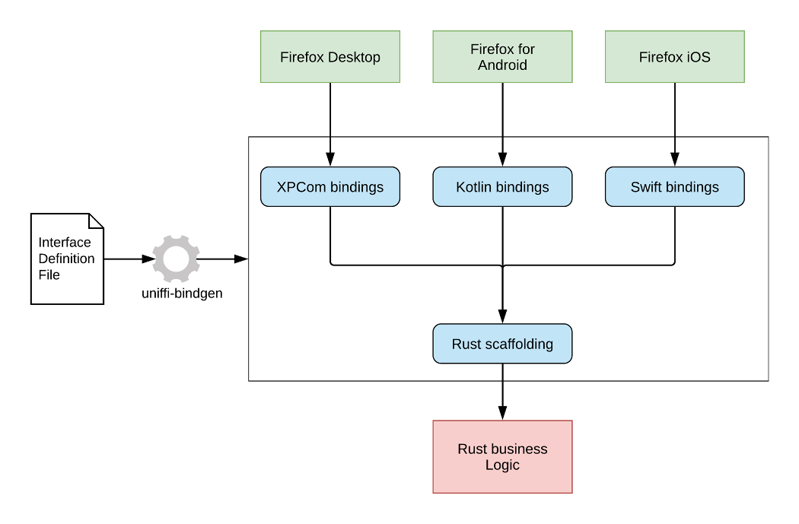
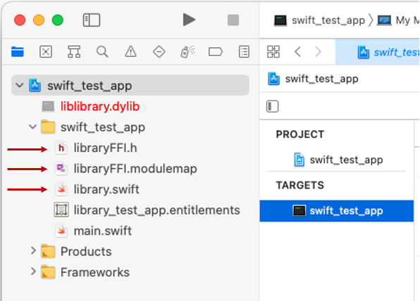

# Creating Language Wrappers For Rust Libraries - Part 1


## Background
Modern software applications are commonly written for multiple computing platforms that each have their own unique sets of capabilities, APIs, and preferred programming languages.  For software developers, this often means creating architectural designs and writing code for one platform and then moving <i>most</i> of the design to the next platform where they restart the coding effort using a different programming language.  This results in a lot of duplicated effort.

To save time and facilitate code reuse, it is common practice to consolidate the business logic of software components into reusable statically-linked or dynamically-linked libraries.  When libraries are created using programming languages that are different from the importing applications, the library is considered *foreign code* by the application.  In order to communicate between the application and library, a common calling and data exchange protocol must be established.  This common protocol is referred to as a [*Foreign Function Interface (FFI)*](https://en.wikipedia.org/wiki/Foreign_function_interface).  

Creating an FFI layer can be very complex.  Part of this complexity is due to the application needing to comply with the memory management requirements introduced by the imported library.  This situation often makes programming difficult for application developers who may be required use the unfamiliar *unsafe* methods (e.g., C-style pointers, allocate, free, etc.) rather than the usual safe methods they regularly use.  For a quick example of how FFI works, please see [Simple Rust Library Foreign Function Interface](https://github.com/sudoplatform-labs/ffi-tutorials/blob/main/Quick_FFI_Intro)

## Tutorial

This tutorial will demonstrate how to create a linkable library using [Rust](https://www.rust-lang.org) and expose interface methods using FFI.  However, in addition to regular FFI, this example will also show how to specify and generate a language-specific *wrapper*.  Using wrappers will insulate developers from the memory management issues described above by exposing a set of methods that more closely resemble those of the application's programming language and models.  This has several benefits, including reducing the overall level of effort for library developers while also simplifying the complexity of including foreign libraries for application developers.

The library created in this tutorial will expose a single function that will receive an input boolean value and return the opposite value.  This tutorial will walk through the process of defining the library interface functions and then generating a language-specific wrapper layer.  Further, this tutorial will demonstrate how to import this library into two distinct user-level applications that are implemented in Python and Swift.


## Mozilla's uniffi Tool Automates FFI Processes

Rust is a very compelling programming language, because it combines the execution speed of lower-level languages (e.g., C) while providing very effective memory management and error checking capabilities that are similar to other modern languages (e.g., Swift).  Rust also provides solid FFI capabilities and is able to interface with most common application languages.  As a result, cross-platform developers are looking to Rust when they create libraries that target multiple platforms.  However, as described above, FFI is a difficult and time-consuming process that creates implementation difficulties for upper-level application developers.

To simplify the process of creating language wrappers, [Mozilla](https://www.mozilla.org) has created a software development tool called *uniffi* (see [https://github.com/mozilla/uniffi-rs](https://github.com/mozilla/uniffi-rs)).   The uniffi tool performs much of the teddious and error-prone coding that is necessary for FFI creation.  It also generates language-specific wrappers with resulting API code that is more familiar and easier for application developers to use.  From the [uniffi User Guide](https://mozilla.github.io/uniffi-rs/):

*"Uniffi is a tool that automatically generates foreign-language bindings targeting Rust libraries.  It fits in the practice of consolidating business logic in a single Rust library while targeting multiple platforms, making it simpler to develop and maintain a cross-platform codebase."*

The uniffi User Guide also presents the following overview of uniffi's main architectural components:



The 3 main elements in this diagram include:  the Interface Definition File, the Rust Scaffolding, and the language-specific bindings.  Using uniffi, developers can automatically generate language-specific bindings for Kotlin (Android), Swift (iOS & macOS), Python, and C++, which will greatly improve development time for those environments.

With the uniffi tools, the high-level wrapper generation process is as follows:

1. Create a custom Rust library
	1. Expose the desired API for the library.  The API will consist of all top-level functions
	2. Setup a Cargo.toml file that specifies that the crate will be built as a dylib
	3. Build and test the library

2. Create a [*UDL*](https://mozilla.github.io/uniffi-rs/udl_file_spec.html) representation of each of the API functions
	1. UDL is a uniffi-specific design language that is a variation of Web Interface Definition Language (Web IDL)
	2. The UDL file will describe each of the top-level functions in the library

3. Use the uniffi tool to create a [*scaffolding layer*](https://mozilla.github.io/uniffi-rs/tutorial/Rust_scaffolding.html) for the library
	1. The scaffolding layer is a set of helper code that is used to make the top-level functions available to the foreign-language bindings

4. Create language-specific [bindings](https://mozilla.github.io/uniffi-rs/tutorial/foreign_language_bindings.html)
	1. This makes FFI calls look & feel like native code (e.g., Swift FFI feels like native Swift)

5. Import the scaffolding code, the language-specific code, and the generated library into a native application


## Installing uniffi
Installing the uniffi tools is easily performed with *cargo*, as follows:

```
cargo install uniffi_bindgen
```

## Creating the Rust Library
To get started, open a terminal window and create a project directory that will contain each of the library and applications for this tutorial.  In the terminal, navigate to the project directory and create a new Rust library called *library*, as follows:

```
cargo new --lib library
``` 

Next, navigate into the new *library* sub-directory just created, open Cargo.toml, and add the following:

```
[dependencies]
uniffi = "0.14"
  
[lib]
name = "library"
crate-type = ["cdylib"]
 
[build-dependencies]
uniffi_build = "0.14"
```

These additions tell cargo to load uniffi version 0.8 and to create a cdylib named library.  

Now, go into the src sub-directory, edit lib.rs, and add the following lines to the **top** of the file:

```
include!("library.uniffi.uniffi.rs");
   
fn bool_inc_test(value: bool) -> bool {
   
    return !value
}   
```

The include statement instructs the Rust compiler to load the language-specific binding file, which will be created below.  The Rust function is a simple function that receives a boolean value and returns its inverse.  Since bool_inc_test( ) is a top-level function, it is part of the API that the library will expose externally ... which is convenient, since it's the only function in the library.

## Create the UDL File
With the Rust library created and its API defined, it's time to create the UDL file.  Staying in the library/src directory, create a file called *library.uniffi.udl*.  The naming convention is such that the name 'library' is the name chosen in this tutorial for the library and 'uniffi.udl' shows that it's a uniffi UDL file.  Add the following lines to the new UDL file:

```
namespace library {

    boolean bool_inc_test(boolean value);

};
```

In UDL, all of the API functions must be specified in the UDL file under the *namespace* block.  The UDL reads like a type of pseudocode that easily describes the function definition.  The types used in this file adhere to the [UDL specification](https://mozilla.github.io/uniffi-rs/udl_file_spec.html).  UDL can be used to specify many other types, enumerations, structs, dictionaries, interfaces, objects, and errors; however, those are not covered in this tutorial. 

## Generate The Scaffolding Layer

The scaffolding layer is set of code that exposes the library's API and serializes the specified data types as an enhanced FFI layer.  Generating the scaffolding layer is a simple process that is done at the command line by typing:

```
uniffi-bindgen scaffolding ./src/library.uniffi.udl
```

Executing this command will create a file called *./src/library.uniffi.uniffi.rs*. It is important to *not* modify this file.  However, viewing it in a code editor will show that ~143 lines of Rust code have been created. This code constitutes the FFI and contains numerous comments describing its operation.  The FFI routine correspondig to the API function, bool_inc_test( ), created above is found at line ~118 and is as follows:

```
124 #[allow(clippy::all)]
125 #[doc(hidden)]
126 #[no_mangle]
127 pub extern "C" fn library_12e5_bool_inc_test(
128     value: i8,
129     err: &mut uniffi::deps::ffi_support::ExternError,
130 ) -> i8 {
131     // If the provided function does not match the signature specified in the UDL
132     // then this attempt to call it will not compile, and will give guidance as to why.
133     uniffi::deps::log::debug!("library_12e5_bool_inc_test");
134 
135     uniffi::deps::ffi_support::call_with_output(err, || {
136         let _retval = bool_inc_test(<bool as uniffi::ViaFfi>::try_lift(value).unwrap());
137         <bool as uniffi::ViaFfi>::lower(_retval)
138     })
139 }
```

While this code contains a valid FFI function and can be called, it is also in a format that might appear a little strange to application programmers who are not also C-programmers.  For that reason a language-specific wrapper function can simplify calls into the library.

## Build the Rust Library

Go to the library sub-directory and type:

```
cargo build
```

This will build the Rust library according to the settings in Cargo.toml.  If everything is successful, the output should be similar to:

```
% cargo build
   Compiling ...
   ...
    Finished dev [unoptimized + debuginfo] target(s) in 20.54s
```

## Genrating a Swift Language Wrapper

With the library created and the scaffolding layer generated, it is time to create the Swift-language bindings.  This also consists of a single line of code:

```
uniffi-bindgen generate ./src/library.uniffi.udl --language swift
```

This command should complete without error.  However, it does rely on a tool called *SwiftFormat*, which, if not installed, will yield a warning similar to the following:

```
Warning: Unable to auto-format library.swift using swiftformat: Os { code: 2, kind: NotFound, message: "No such file or directory" }
```

If this warning appears, it may simply be ignored and will result in no ill effects during execution of the applications importing this library.  However, to reformat the Swift code (and make this warning disappear), it is necessary to install the tool, which can be installed using *brew* as follows:

```
brew install swiftformat
```

Once SwiftFormat is installed, run the uniffi-bindgen command again and the generated Swift-language code will be regenerated and formatted without a warning message.

This process generates a file called *library.swift* that has ~500 lines of code.  The last function in the file contains the Swift representation of the bool_inc_test( ) function and appears as follows:

```
566 public func boolIncTest(value: Bool) -> Bool {
567     let _retval = try! rustCall(
568         UniffiInternalError.unknown("rustCall")
569 
570     ) { err in
571         library_12e5_bool_inc_test(value.lower(), err)
572     }
573     return try! Bool.lift(_retval)
574 }
```

Notice that the Swift function has been formatted in the style of other Swift source code -- even the name has been converted from *snake case* (used in Rust) to *camel case* (used in Swift).  Additionally, this Swift function invokes (on line 497) the function, library_12e5_bool_inc_test( ), that was generated in *./src/library.uniffi.uniffi.rs* above.  

Although, this language wrapper generation step isn't strictly necessary from an FFI perspective, it is of notable value to the Swift programmers who will import the library.  This step allows them to interface with a code interface to the library the looks and feels like Swift rather than having to learn how to call C programming interfaces.

## Genrating a Python Language Wrapper

With the library created and the scaffolding layer generated, it is time to create the Python-language bindings.  (The steps to creating the Python wrapper will be very similar to those used to generate the Swift code above.) This also consists of a single line of code:

```
uniffi-bindgen generate ./src/library.uniffi.udl --language python
```

This command should complete without error.  However, it does rely on a tool called *yapf*, which, if not installed, will yield a warning similar to the following:

```
Warning: Unable to auto-format library.py using yapf: Os { code: 2, kind: NotFound, message: "No such file or directory" }
```

If this warning appears, it may simply be ignored and will result in no ill effects during execution of the applications importing this library.  However, to reformat the Python code (and make this warning disappear), it is necessary to install the tool, which can be installed using *brew* as follows:

```
brew install yapf
```

Once yapf is installed, run the uniffi-bindgen command again and the generated Python-language code will be regenerated and formatted without a warning message.

This process generates a file called *library.py* that has ~300 lines of code.  The last function in the file contains the Python representation of the bool_inc_test( ) function and appears as follows:

```
285 def bool_inc_test(value):
286     value = bool(value)
287     _retval = rust_call_with_error(InternalError,_UniFFILib.library_12e5_bool_inc_test,(1 if value else 0))
288     return (True if _retval else False)
```

Notice that the Python function has been formatted in the style of other Python source code.  Additionally, this Python function invokes (on line 497) the function, library_a699_bool_inc_test( ), that was generated in *./src/library.uniffi.uniffi.rs* above.  

Although, this language wrapper generation step isn't strictly necessary from an FFI perspective, it is of notable value to the Python programmers who will import the library.  This step allows them to interface with a code interface to the library the looks and feels like Python rather than having to learn how to call C programming interfaces.


## Swift Application: Calling the Rust Library

Once the library has been created, the scaffolding layer generated, and the Swift language wrapper generated, it is time to test importing the library into a Swift application.  To test this part of the tutorial, a macOS Swift app will be created.  To create the test app, do the following:

1. Launch Xcode and select File | New | Project  
2. Click *macOS* for the new project template
3. Select *Command Line Tool* and click *Next*
4. Name the project *swift\_test\_app* and click *Next*
5. A dialog box will appear asking where to save the project.  Select the main tutorial directory used for this tutorial and press *Create*

The preceeding steps will result in an empty, but runnable, Swift-based command line tool for macOS.  Next, the library must be linked and the scaffolding layer and language bindings must be added to the Xcode project, as follows:

1. In Xcode, select the target *swift_test_app*, select *General*, and add the Rust library (../library/target/debug/liblibrary.dylib) to the *Frameworks and Libraries* section, as follows:

2. Add the directory containing the Rust library (dylib) to the Xcode project's *Library Search Paths*
3. Add the Swift language files generated by uniffi above.  The files to be added include
	1. library.swift
	2. uniffi_library-Bridging-Header.h

	
4. Add the bridging header to the Xcode target by adding *../library/src/uniffi_library-Bridging-Header.h* to *Swift Compiler - General*

At this point, the test app should import the required files, link to the library, and run ... without doing anything.  To test the library, it is necessary to add some function calls to *main.swift*, as follows:

```
1	//
2	//  main.swift
3	//  swift_test_app
4
5	import Foundation
6
7	print(" --- Running boolean test ---")
8	let valueBool: Bool = false
9	var resultBool: Bool = boolIncTest(value: valueBool)
10	assert(!valueBool == resultBool, "Bool test failed")
11
12	print(" --- All Tests Succeded! --- ")

```
In this very simple test, *valueBool* is initialized to *false* on line 8.  This value is passed to the function *boolIncTest( )* on line 9 and the return value is stored in resultBool.  On line 10, an assert statement compares the 2 values to ensure that they are different.  If *boolIncTest( )* is successfuly called from the linked library and a valid result value is received, then the following message should be displayed:

```
 --- Running boolean test ---
 --- All Tests Succeded! --- 
Program ended with exit code: 0
```
<BR>

## Python Application: Calling the Rust Library

Creating the Python test application is much simpler than the Swift version, because it does not need a project configuration.  To create the Python test application, do the following:

1. Go to the tutorial main directory and create a sub-directory called *python_test_app* and navigate into it
2. Copy the required library files into *python_test_app*
	1. ./library/target/debug/libuniffi_library.dylib (*Note:  currently, building the Rust library creates a filed called liblibrary.dylib.  As part of this copy step, the library should be renamed as libuniffi_library.dylib.  This descrepancy will likely be resolved in future versions of uniffi.*)
	2. ./library/src/library.py
3. Create the main Python application file (main.py) and add the following:

```
1 import library
2 
3 value = True
4 print('\n The opposite of ' + str(value) + ' is ' + str(library.bool_inc_test(value)) + '\n')
```

To execute main.py, type

```
python3 main.py
```

If *library.bool_inc_test( )* was successfully invoked, the following output should be displayed int the terminal:

```
% python3 main.py

 The opposite of True is False

% 
```

## Conclusion

Developing reusable libraries in Rust is an exellent way to build the business logic once and then reuse it across several languages and platforms.  While FFI makes it possible to call Rust libraries from a variety of different programming languages, its requirement for application developers to make C-language calls into linked libraries is confusing and burdensome.  The uniffi tool from Mozilla dramatically simplifies the software development process by automatically generating the scaffolding layer and building language-specific bindings, which simplify the integration effort for application developers. The next tutorial builds upon the processes presented and demonstrates how to exchange data between Rust libraries and applications written in upper level languages, such as Swift and Python (please see [Creating Language Wrappers For Rust Libraries - Part 2](https://github.com/sudoplatform-labs/ffi-tutorials/blob/main/Wrapper_Data_Types)).
